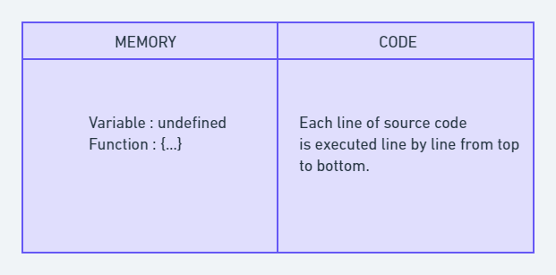
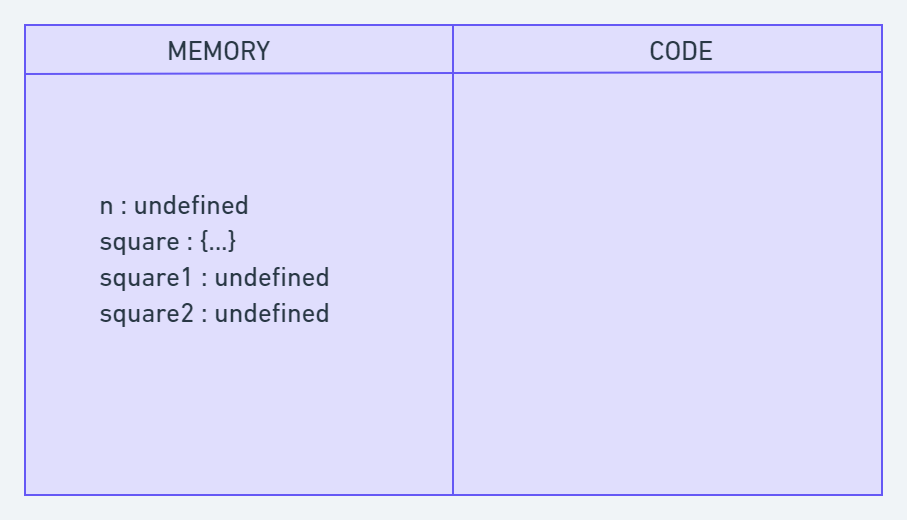
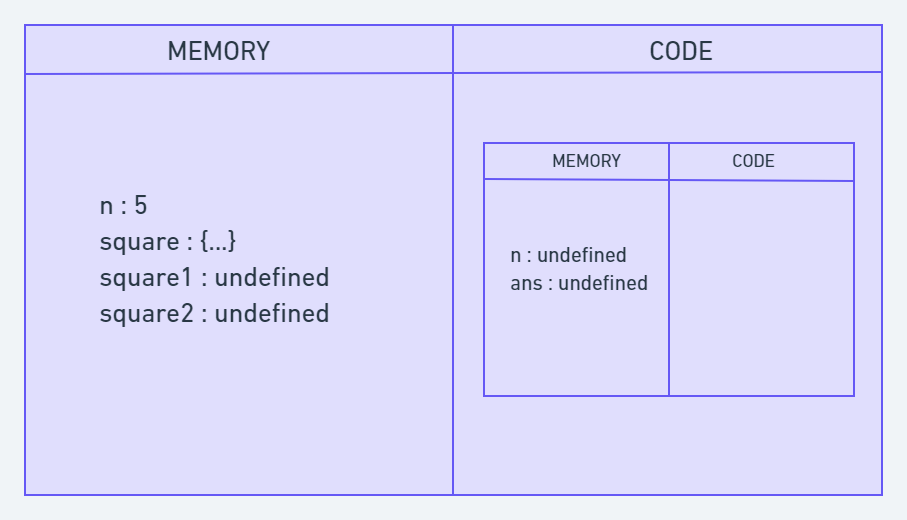
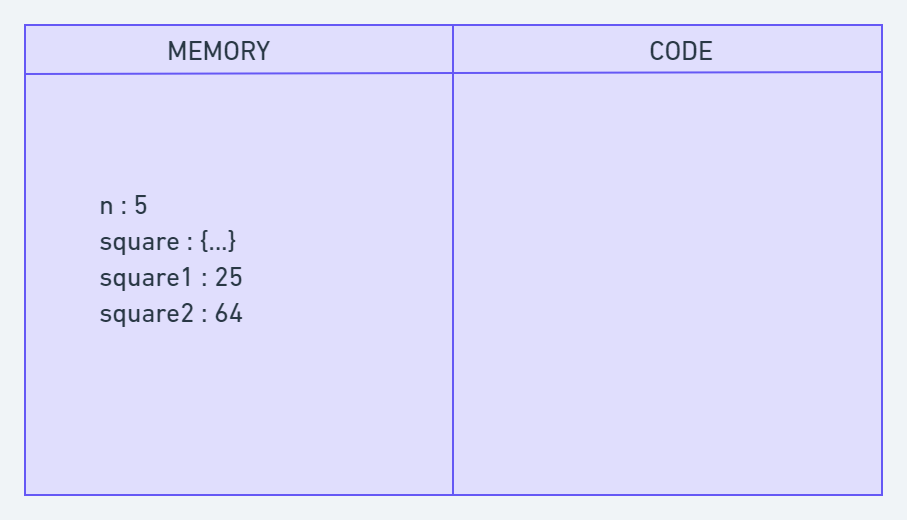
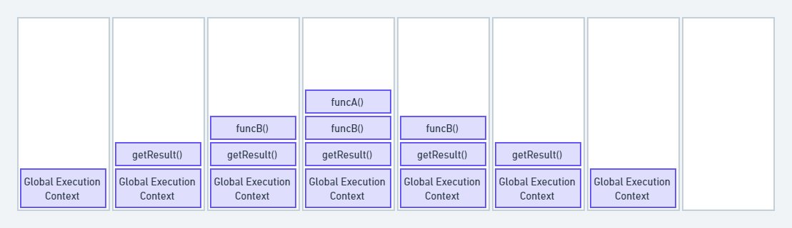

# How JavaScript Works & Execution Context 

- Javascript is **synchronous single-threaded interpreted langauage**. This means javascript can execute one command at a time in a specific order. It can go to the next command if and only if the current command is finished executing.
- Browser cannot directly understand JavaScript code and it uses a JavaScript engine execute JavaScript codes. Each browser has its own JavaScript engine. Google Chrome has the V8 engine, Mozilla Firefox has SpiderMonkey, and so on

``` javascript
    var n = 5;

    function square(n) {
    var ans = n * n;
    return ans;
    }

    var square1 = square(n);
    var square2 = square(8);  

    console.log(square1)
    console.log(square2)
```

In the above code,
1. n is initialized and assigned a value of 5.
2. We defined a function square() that accepts an argument n and returns the square of n.
3. We call the square() function and store the returned value in the square1 variable.
4. We call the square() function and store the returned value in the square2 variable.
5. Finally, it outputs both square1 and square2.

Behind the scenes JavaScript is doing a lot things. Let's understand all of it.

### What is the Execution Context?
- When the JavaScript engine scans a script file, it makes an environment called the **Execution Context** that handles the entire transformation and execution of the code.
- During the context runtime, the parser parses the source code and allocates memory for the variables and functions. The source code is generated and gets executed.
- There are two types of execution contexts:
    1. **Global Execution Context**: The global execution context is created when a JavaScript script first starts to run, and it represents the global scope in JavaScript.
    2. **Function Execution Context**:  A function execution context is created whenever a function is called, representing the function's local scope.

### Phases of the JavaScript Execution Context
There are two phases of JavaScript execution context:
1. **Creation Phase**: In this phase, the JavaScript engine creates the execution context and sets up the script's environment. It determines the values of variables and functions and sets up the scope chain for the execution context.
2. **Execution phase**: In this phase, the JavaScript engine executes the code in the execution context. It processes any statements or expressions in the script and evaluates any function calls.

- Everthing in JavaScript happens inside an Execution Context.
- Execution Context consist of two components
    - **Memory**
    - **Code**

**Note**: These phases and components are applicable to both global and functional execution contexts.

### Creation Phase


Take a look at this example once again:

``` javascript
    var n = 5;

    function square(n) {
    var ans = n * n;
    return ans;
    }

    var square1 = square(n);
    var square2 = square(8);  

    console.log(square1)
    console.log(square2)
```

At the very beginning, the JavaScript engine executes the entire source code, creates a global execution context, and then does the following things:
        1. Creates a global object that is **window** in the browser and **global** in NodeJs.
        2. Sets up a memory for storing variables and functions.
        3. Stores the variables with values as undefined and function references.

This is called the creation phase.Here's a diagram to help explain it:



After creation phase, the execution context will move to the code execution phase.

### Execution Phase
- In execution phase, it starts going through the entire code line by line from top to bottom. 
- As soon as it encounters n = 5, it assigns the value 5 to 'n' in memory. Until now, the value of 'n' was undefined by default.
- Now it goes to the 'square' function, as the function has been allocated in memory, it directly jumps to next line.
- Now in line **var square1 = square(n);**, **square()** will be invoked and JavaScript will create a new function excution context. 



- Once the calculation is done, it assigns the value of square in the 'ans' variable that was undefined before. The function will return the value, and the function execution context will be destroyed.
- The returned value from square() will be assigned on square1.
- This happens for square2 also. Once the entire code execution is done completely, the global context will look like this and it will be destroyed also.



### What is the Call Stack?
- To keep the track of all the contexts, including global and functional, the JavaScript engine uses a call stack. A call stack is also known as an 'Execution Context Stack', 'Runtime Stack', or 'Machine Stack'.
- It uses the LIFO principle (Last-In-First-Out). When the engine first starts executing the script, it creates a global context and pushes it on the stack. Whenever a function is invoked, similarly, the JS engine creates a function stack context for the function and pushes it to the top of the call stack and starts executing it.
- When execution of the current function is complete, then the JavaScript engine will automatically remove the context from the call stack and it goes back to its parent.

- Let's look at the following example:

    ``` javascript
        function funcA(m,n) {
            return m * n;
        }

        function funcB(m,n) {
            return funcA(m,n);
        }

        function getResult(num1, num2) {
            return funcB(num1, num2)
        }

        var res = getResult(5,6);

        console.log(res); // 30
    ```

- In the above example the JS engine creates a global execution context that enter the creation phase.
- First it allocates memory for **funcA**, **funcB**, the **getResult** function, and the **res** variable. Then it invokes **getResult()**, which will be pushed on the call stack.
- Then **getResult()** will call **funcB()**. At this point, **funcB**'s context will be stored on the top of the stack. Then it will start executing and call another function **funcA()**. Similarly, **funcA**'s context will be pushed. 
- Once execution of each function is done, it will be removed from the call stack. 



- The call stack has its own fixed size depending on the system or browser. If the number of contexts exceeds the limit, then a stack overflow error will occur. This happens with a recursive function that has no base condition.

``` javascript
    function display() {
        display();
    }

    display();
```

``` bash 
    C:\Users\anoop\Desktop\Javascript\n.js:2
        display();
        ^
    RangeError: Maximum call stack size exceeded
```

### Conclusion
- In conclusion, JavaScript execution context is a crucial part of understanding how JavaScript works behind the scenes. It determines the environment in which code is executed and what variables and functions are available to use.
- The creation phase includes creating the global and function execution contexts, creating the scope chain, and allocating memories for the variables and functions. During the execution phase, the JavaScript engine executes the code line by line. This includes evaluating and executing statements.